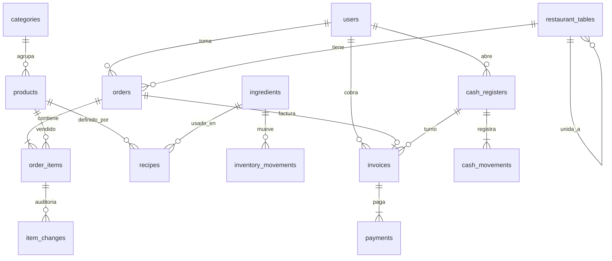

# Base de datos

Motor: **SQLite**, archivo único `data/restaurante.db` (más `-wal`/`-shm` mientras el sistema está abierto).

No hay sucursales: un local, una caja abierta a la vez, un archivo.

## Diagrama de relaciones

## Cómo se relacionan las piezas de negocio

1. Un **producto** del menú tiene precio y, opcionalmente, una **receta**: filas en `recipes` con `product_id`, `ingredient_id` y `quantity` (ej. hamburguesa = 1 pan + 150 g carne + 2 hojas de lechuga…).
2. El mesero abre una **comanda** (`orders`) ligada a una **mesa**. Los platos son `order_items` (se guarda el nombre y el precio del momento). Las ediciones y anulaciones van a `item_changes` con el usuario.
3. Al **facturar**, se crea `invoices` + `payments` (efectivo, nequi, daviplata). La comanda pasa a `billed` y la mesa a libre. Ahí se recorre la receta de cada ítem no anulado y se descuenta `ingredients.stock`, dejando una salida tipo `sale` en `inventory_movements`.
4. Las ventas en efectivo alimentan `cash_movements` del **turno** abierto (`cash_registers`). El cierre compara efectivo contado vs. base + efectivo vendido − egresos.

## Tablas (resumen)

| Tabla | Rol |
|-------|-----|
| `users` | Usuarios y rol fijo: `admin`, `waiter`, `kitchen`, `cashier` |
| `restaurant_tables` | Mesas; `joined_to_id` si está unida a otra |
| `categories` / `products` | Menú |
| `ingredients` / `recipes` | Stock y recetas |
| `inventory_movements` | Entradas (compra), salidas (venta), ajustes, merma |
| `orders` / `order_items` | Comandas |
| `item_changes` | Quién cambió o anuló un ítem |
| `invoices` / `payments` | Tickets y formas de pago |
| `cash_registers` / `cash_movements` | Turnos de caja |
| `settings` | Nombre del local, IVA, impresora, etc. |
| `backup_log` | Registro de respaldos |

El esquema concreto se crea al iniciar en `server/db.js` (`CREATE TABLE IF NOT EXISTS`).

## Respaldos

- Automático: al arrancar, si no hubo uno ese día, copia `data/restaurante.db` a `backups/restaurante-AAAAMMDD-HHMMSS-auto.db`.
- Manual: Ajustes → Crear respaldo, o `npm run backup`.
- Se conservan los 14 archivos más recientes.

Para restaurar: cierre el sistema, reemplace `data/restaurante.db` por una copia de `backups/`, vuelva a ejecutar `iniciar.bat`.
